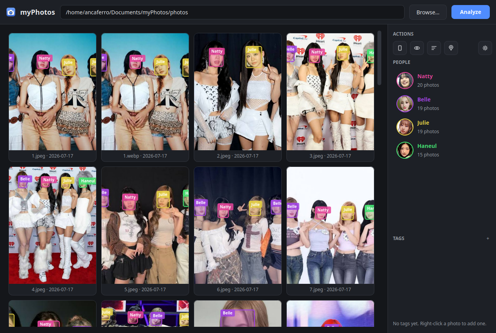
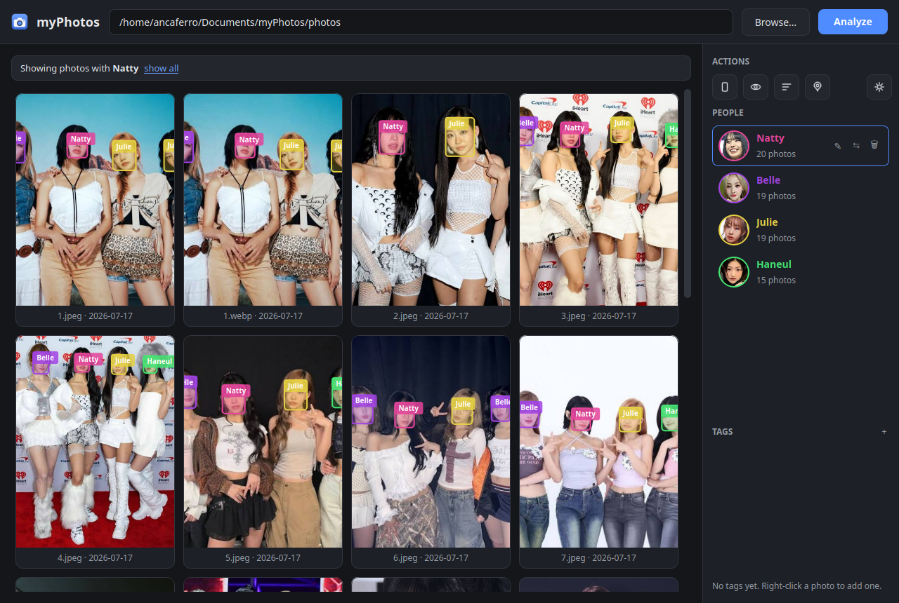
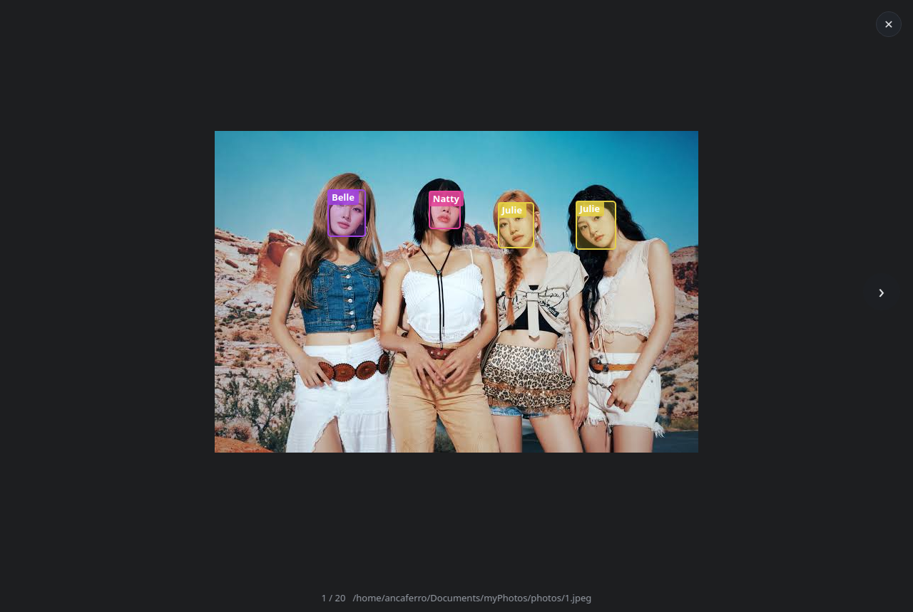

<div align="center">

# 📷 FaceVault AI

### Intelligent Local Photo Cataloging & Face Detection Desktop Application

Developed & Maintained by **[jarifovi](https://github.com/jarifovi)**


---

</div>

## 👤 Developer & Credit

- **Author**: [jarifovi](https://github.com/jarifovi)
- **GitHub Repository**: [https://github.com/jarifovi/face-vault-Detection](https://github.com/jarifovi/face-vault-Detection)
- **License**: MIT License

---

## 🌟 Overview

**FaceVault AI** is a state-of-the-art desktop application built with Python, PySide6, and OpenCV. It brings privacy-focused, 100% offline face detection, face recognition clustering, and smart photo cataloging to your local machine.

No data ever leaves your computer. Your photos, detected face embeddings, custom tags, and metadata are indexed locally into a SQLite database.

---

## 🖼️ User Interface Preview

<div align="center">

### Responsive Photo Gallery with Face Highlighting


### Filtered Person View & Person Management


### Full-Size Interactive Lightbox Viewer


</div>

---

## ✨ Key Features

- **🔍 Recursive Folder Scanning**: Analyzes deep folder trees for images (`.jpg`, `.jpeg`, `.png`, `.webp`, `.bmp`, `.tiff`).
- **🤖 Deep Learning Face Detection**: Utilizes OpenCV **YuNet** for ultra-fast face detection and **SFace** for 128-dimensional face embedding extraction.
- **👥 Automatic Person Clustering**: Groups face embeddings into distinct personas (`Persona 1`, `Persona 2`, …) using fast greedy algorithms and average-linkage hierarchical clustering.
- **🏷️ Smart Tagging & Metadata**: Tag individual or batch photos with custom labels. Filter photos by person, tag, or EXIF GPS location.
- **🔍 Full-Screen Lightbox**: Mouse-wheel zoom around cursor, click-and-drag panning, keyboard navigation (`←`/`→`), and instant face box inspection.
- **📍 EXIF Geolocation & Map Link**: Extracts GPS coordinates from photos, allows filtering geotagged photos, and opens locations directly in OpenStreetMap.
- **⚡ Disk Caching & Fast SQLite**: Asynchronous multi-threaded thumbnail loader with disk cache ensures lightning-fast gallery scrolling even with thousands of images.
- **🔒 100% Offline & Private**: Zero external cloud calls. All face embeddings and data stay safely on your local disk.

---

## 🏗️ Tech Stack & Architecture

| Component | Technology Used |
| :--- | :--- |
| **GUI Framework** | PySide6 (Qt for Python) |
| **Face Detection** | OpenCV DNN Module + **YuNet** |
| **Face Recognition** | OpenCV **SFace** ONNX Model |
| **Data Storage** | SQLite 3 (WAL Journal Mode) |
| **Image Processing** | Pillow (PIL) + OpenCV |
| **Testing** | Pytest (100% offscreen synthetic test suite) |

---

## 🚀 Quick Start Guide

### Prerequisites
- Python **3.10+** installed on your system.

### 1. Clone the Repository
```bash
git clone https://github.com/jarifovi/face-vault-Detection.git
cd face-vault-Detection
```

### 2. Set Up Virtual Environment & Install Dependencies
```bash
python -m venv venv
# On Windows:
.\venv\Scripts\activate
# On Linux/macOS:
source venv/bin/activate

pip install -r requirements.txt
```

### 3. Download AI Models
Fetch the official YuNet and SFace ONNX models from OpenCV Zoo:
```bash
python scripts/download_models.py
```

### 4. Run FaceVault AI
```bash
python main.py
```

---

## ⌨️ Keyboard Shortcuts & Navigation

| Key / Action | Function |
| :--- | :--- |
| `Esc` | Clear active search/person filters or close Lightbox |
| `Enter` | Open selected photo in full-screen Lightbox |
| `←` / `→` | Navigate to previous/next photo |
| `Mouse Wheel` | Zoom in/out around cursor in Lightbox |
| `Drag` | Pan zoomed image in Lightbox |
| `Right Click` | Open contextual menu (Face assignments, tagging, geotag options) |

---

## 🧪 Testing

Run the full offscreen unit test suite (100 tests covering face math, database queries, GUI state, and lightbox interactions):

```bash
pip install -r requirements-dev.txt
pytest
```

---

## 📦 Building Executables

Package FaceVault into a standalone `.exe` or executable binary using PyInstaller:

```bash
pip install pyinstaller
python scripts/download_models.py
pyinstaller facevault.spec
```

The resulting standalone application will be compiled into the `dist/` directory.

---

## 📁 Repository Structure

```text
face-vault-Detection/
├── main.py                     # Main application entry point & setup
├── analyzer.py                 # Face detection & clustering pipeline
├── database.py                 # SQLite database storage & schema
├── paths.py                    # Cross-platform path resolution
├── facevault.spec              # PyInstaller executable build spec
├── Makefile                    # Process management & run commands
├── gui/                        # PySide6 desktop UI components
│   ├── window.py               # Main window layout & filter handling
│   ├── gallery.py              # Responsive photo thumbnail grid
│   ├── lightbox.py             # Fullscreen image viewer with zoom & pan
│   ├── people.py               # Person sidebar & portrait list
│   ├── tags.py                 # Tag sidebar & tag filter panel
│   ├── settings.py             # App preferences & parameters dialog
│   ├── thumbs.py               # Async disk-cached thumbnail loader
│   ├── facepaint.py            # Bounding box painter utility
│   ├── data.py                 # GUI database interaction layer
│   └── theme.py                # Modern dark palette & QSS styling
├── scripts/                    # Utility scripts
│   ├── download_models.py      # ONNX model download script
│   └── make_icon.py            # App icon generation script
├── tests/                      # Pytest automated test suite (100 tests)
├── assets/                     # Application icons and logos
├── screenshots/                # Documentation screenshots
└── .github/workflows/          # CI/CD GitHub Actions workflows
```

---

## 👨‍💻 Author & Attribution

Developed with ❤️ by **[jarifovi](https://github.com/jarifovi)**.

If you find **FaceVault AI** useful, please consider giving the repository a ⭐ on [GitHub](https://github.com/jarifovi/face-vault-Detection)!
